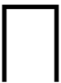
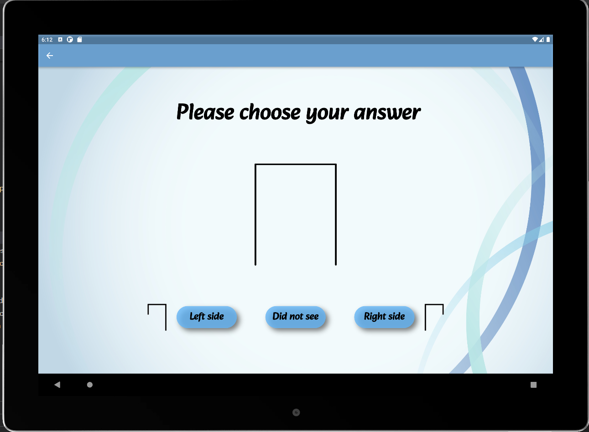
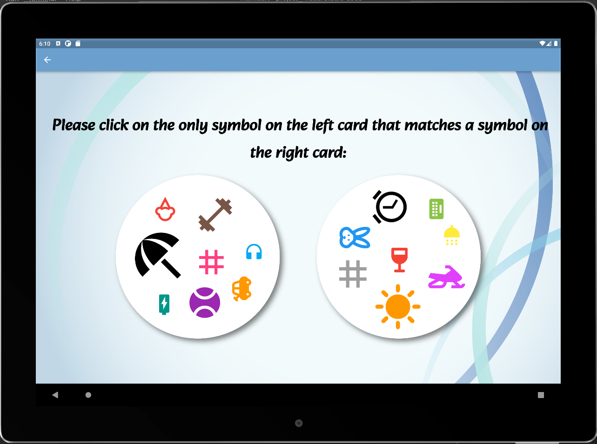
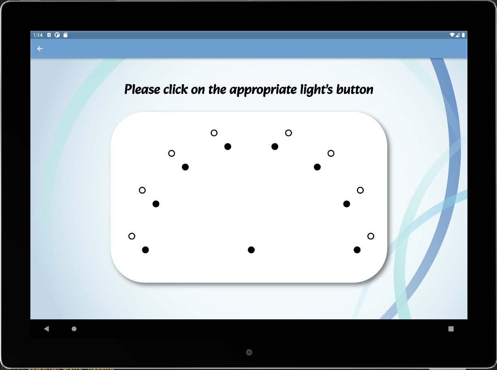
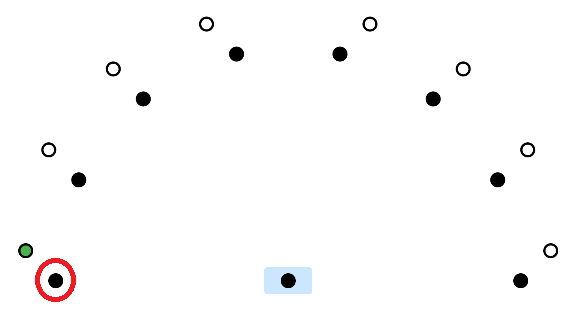
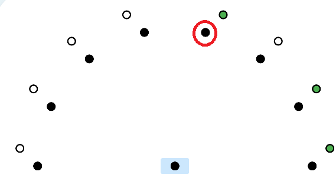

# ECT Project

A flutter application that will be used to diagnose students and analyze data.
This application consists of three thinking exercises; each exercise tests the student's abilities from different aspects. The
application saves the participant's data and analyzes the results.

- [ECT Project](#ect-project)
  - [First Exam](#first-exam)
  - [Second Exam: Double game](#second-exam-double-game)
  - [Third Exam](#third-exam)
  - [Application outputs](#application-outputs)
  - [Data Analysis](#data-analysis)

$~$

## First Exam

**Exam explanation :** In this exam, an "open" shape appears for several milliseconds (right side shape or left side shape).

$~$

right side
 left side

$~$

As soon as the time period has expired, the form is replaced with a "complete" form.

$~$

 complete form

$~$

The user will have to choose which the direction of the shape he saw. For each round we save the time that the shape presented and the correctness of the answer. 

$~$

$~$

The user will be presented with the choice again, but the amount of time he is exposed to it will decrease if he made the correct choice. If the user was wrong the time will increase and the exam will continue.

$~$

## Second Exam: Double game

**Exam explanation :** In this exam, the user is presented with two cards, each of which has only one common symbol. The user needs to identify the common symbol and press on it as quickly as possible. For each round we save the identification time of the user and the side of the card he pressed on. 

$~$

$~$

## Third Exam

**Exam explanation :** In this exam, the user is required to identify the lightning of the light bulbs and press the appropriate light bulb's button: 

$~$

$~$

- if one light turned, the user will need to click the button of that light.

$~$

- if three lights turned, the user will need to click the light's button that is farthest away from the other two lights.

$~$

$~$

## Application outputs

When the user finishes all the exams, the application creates a folder with four files including the user information and the exams results of the user.
These results will be used for analyzation.

$~$

## Data Analysis

$~$