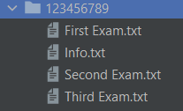
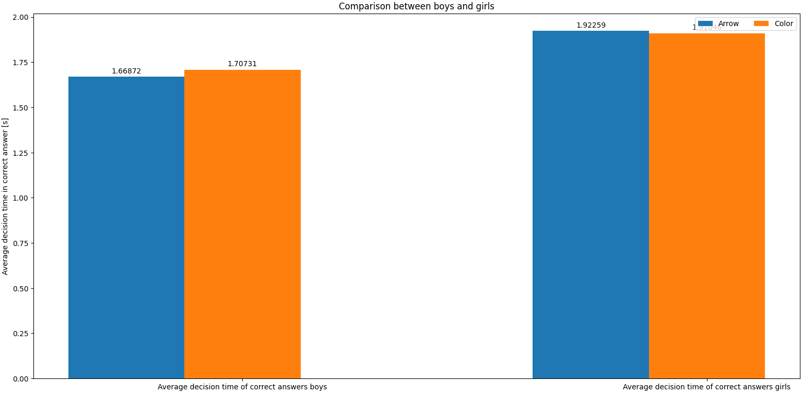
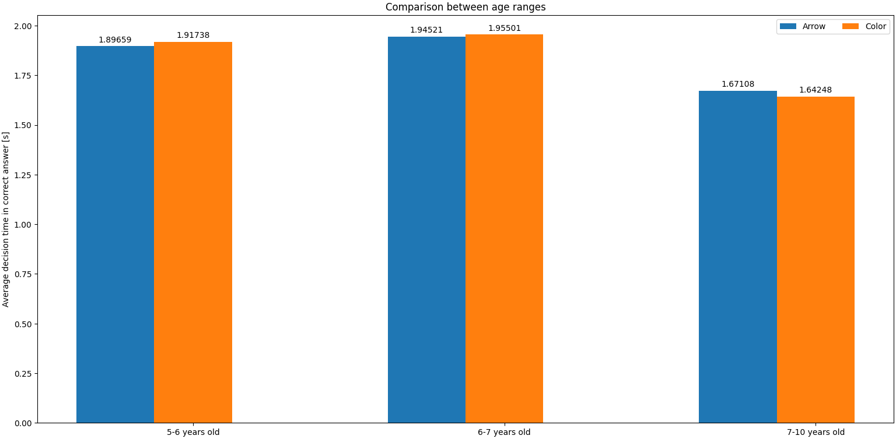
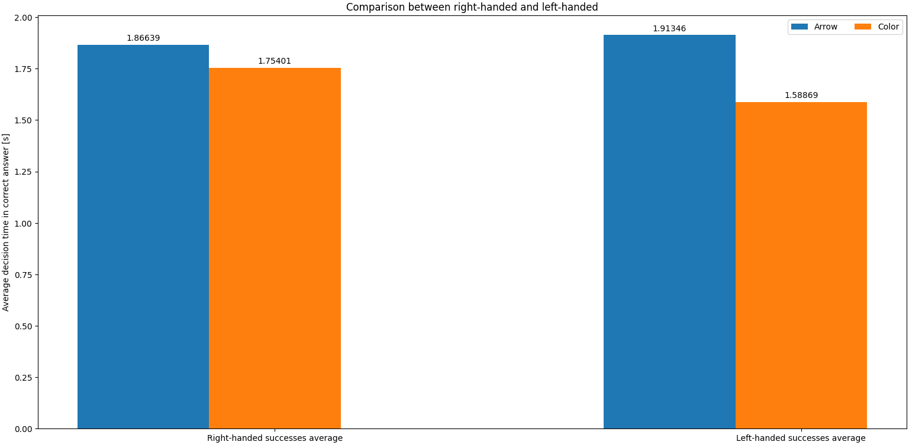

# ECT Project

A flutter application that will be used to diagnose students and analyze data. 
This application consists of three thinking exercises; each exercise tests the student's abilities from different aspects. 
The application saves the participant's data and analyzes the results.

- [ECT Project](#ect-project)
  - [First Exam](#first-exam)
  - [Second Exam: Double game](#second-exam-double-game)
  - [Third Exam](#third-exam)
  - [Application outputs](#application-outputs)
  - [Data Analysis](#data-analysis)

## First Exam

**Exam explanation :**  
In this exam, an "open" shape appears for several milliseconds (right side shape or left side shape).

right side
 left side

As soon as the time period has expired, the form is replaced with a "complete" form.

 complete form

The user will be required to select which direction of the shape he saw before the shape changed. 
In each round we save the time the image was displayed (milliseconds) and the correctness of the answer for each round.

If the user makes the correct choice, he will be presented with the choice again, but the amount of time he is exposed to it will decrease. 
In the event that the user answered the question incorrectly, the time will increase and the exam will continue.

## Second Exam: Double game

**Exam explanation :**  
During the exam, the user is presented with two cards that have only one symbol in common. 
The user must identify the common symbol and press on it as quickly as possible. 
In each round we save identification time.

## Third Exam

**Exam explanation :** 
This exam requires the user to identify the lightning of the light bulbs and select the appropriate button for each light bulb:

The user must hold down the main button (at the bottom of the screen). 
Holding this button will activate one or three lights. 

- If one light turns on, the user will need to click the button associated with that light.

$~$

$~$

- If three lights turn on, the user will need to click the light's button associated with the light that is the furthest from the other two lights.

$~$

In each round, we save the identification time (the time from the moment the user pressed the main button to the time he picked it's pinger from the main button) and the decision time (the time from the moment the user picked it's pinger from the main button to the time the user pressed the light's button).

## Application outputs

As soon as the user completes all the exams, the application creates a folder whose name is the user's ID, containing four files that include user information and their exam results. 

Analyses will be conducted based on these results.

## Data Analysis
We use the pandas and numpy libraries for data analysis. 
Based on the results of the tests, we created a data frame that includes the results of all rounds of the participants. 
With the data frame we created, we extracted the data and compared it based on three categories: gender, right-handedness or left-handedness, and age. 
The comparison results are presented as a graphs:

$~$

$~$

